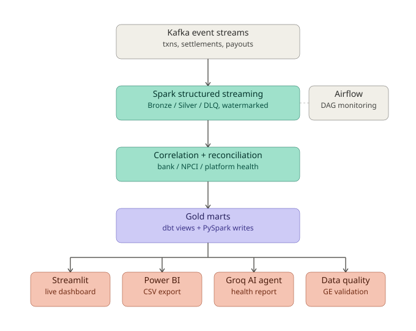
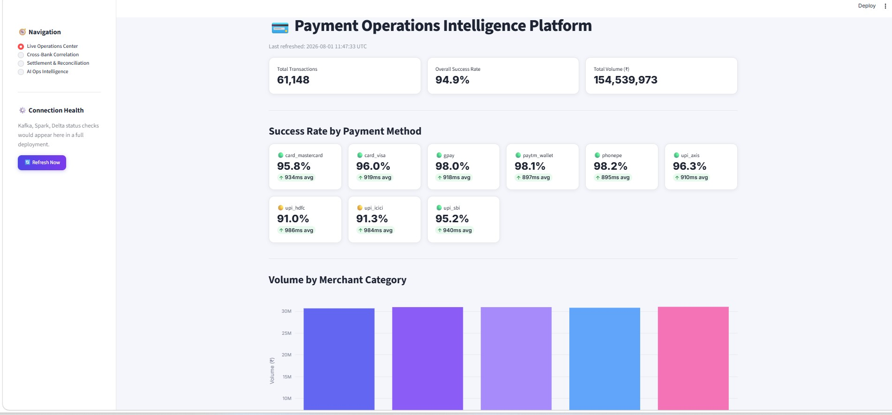
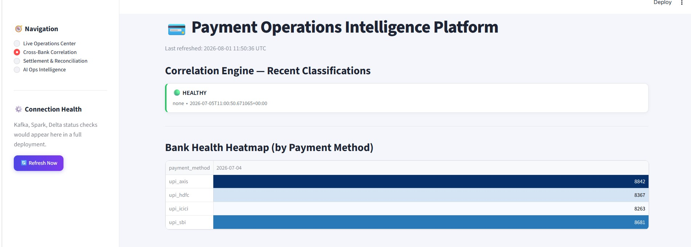
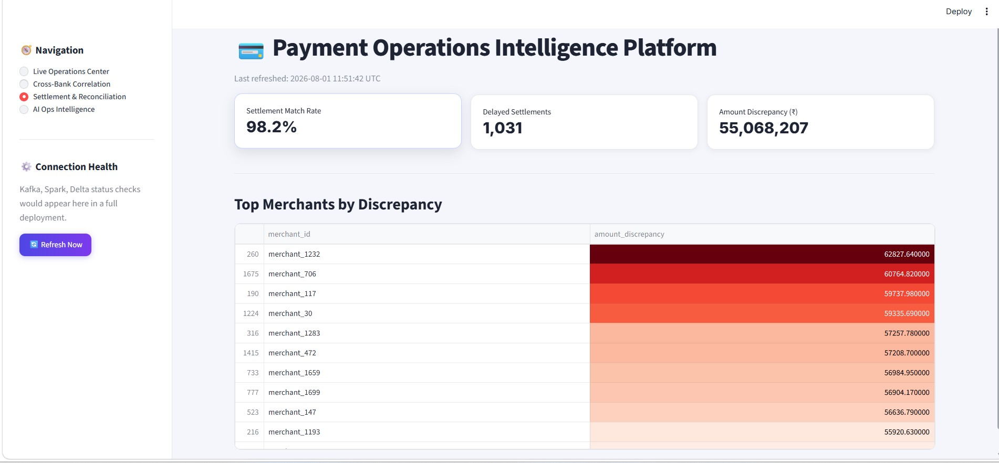
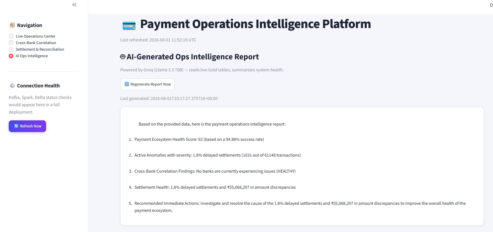
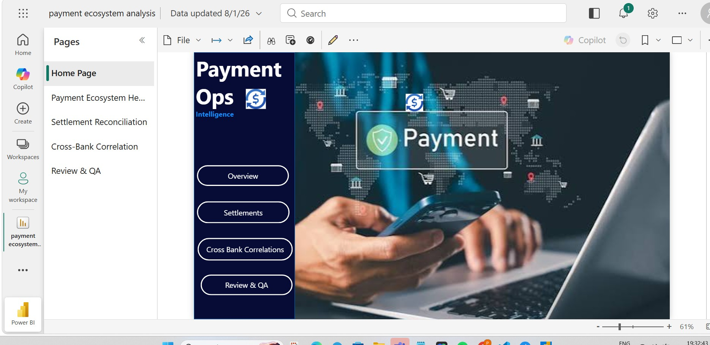
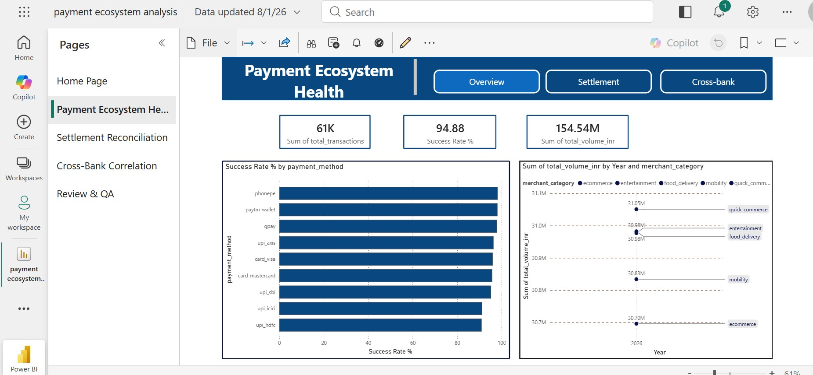
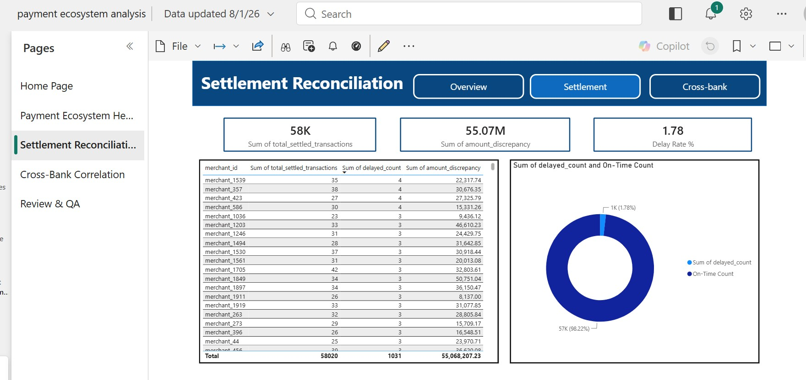
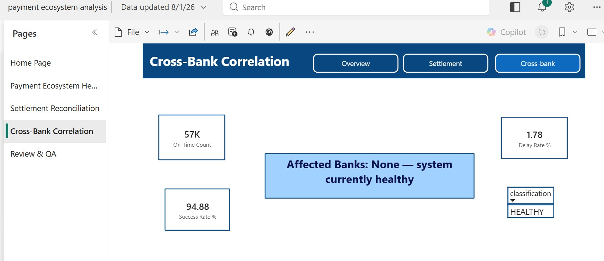

# Payment Ops Intelligence Platform

A real-time payment operations monitoring platform that simulates a UPI/card
payment ecosystem end-to-end — from Kafka event streams through Spark
Structured Streaming, dbt-transformed Gold marts, an ML anomaly detector, an
LLM-powered ops intelligence agent, and dashboards in both Streamlit and
Power BI.

Built as a self-directed portfolio project to demonstrate production-style
data engineering patterns: streaming pipelines with watermarking and DLQ
handling, medallion architecture (Bronze/Silver/Gold), orchestration and
monitoring via Airflow, data quality gating, and an AI layer that reasons
over the pipeline's own output.

---

## What this platform does

It simulates the "ops brain" a payments company (think PhonePe, Razorpay,
or a bank's UPI switch) would build to answer, in real time: *is the
payment ecosystem healthy right now, and if not, whose problem is it —
ours, the bank's, or NPCI's?*

- Generates realistic transaction, settlement, and payout event streams
  (including simulated bank outages and settlement delays)
- Detects anomalies using an Isolation Forest model
- Classifies failures as bank-side, NPCI-side, platform-side, or healthy
  by correlating transaction and settlement streams
- Reconciles settlements against transactions to catch delays, orphans,
  and amount mismatches
- Surfaces all of this through a live Streamlit dashboard, a Power BI
  report, and a Groq-powered LLM agent that generates plain-English
  ops health reports on demand

---

## Tech stack

| Layer | Technology |
|---|---|
| Event streaming | Apache Kafka (local, Docker) |
| Stream processing | Spark Structured Streaming (PySpark) |
| Storage format | Delta Lake |
| Transformation | dbt-spark (staging/intermediate views) + raw PySpark (Gold materialization) |
| ML | scikit-learn (Isolation Forest) |
| Orchestration | Apache Airflow (Docker) |
| Data quality | Great Expectations |
| AI layer | LangChain + Groq (Llama 3.3 70B) |
| Dashboards | Streamlit, Power BI |
| Language | Python 3.11 |

---

## Architecture



<details>
<summary>Text version of the diagram</summary>

```
Kafka (transactions, settlements, payouts)
        │
        ▼
Spark Structured Streaming
  ├─ Bronze (raw JSON, append-only)
  ├─ Silver (parsed, validated, watermarked)
  └─ DLQ (malformed records)
        │
        ▼
Correlation Engine + Multi-Stream Join
  ├─ gold_correlation_events   (bank/NPCI/platform health classification)
  └─ gold_settlement_mismatches (delayed / orphan / amount-mismatch detection)
        │
        ▼
dbt (staging + intermediate views) → PySpark (Gold materialization)
  ├─ mart_ops_dashboard_metrics
  ├─ mart_settlement_reconciliation
  └─ mart_correlation_summary
        │
        ├──────────────┬───────────────┬─────────────────┐
        ▼               ▼               ▼                 ▼
   Streamlit        Power BI      Groq AI Agent    Great Expectations
   Dashboard        (CSV export)  (ops report)      (quality gates)
```

Airflow runs two independent monitoring DAGs (`kafka_lag_monitor`,
`streaming_health_monitor`) that watch the pipeline's own health.

</details>

See [`SYSTEM_DESIGN.md`](./SYSTEM_DESIGN.md) for the deeper technical
writeup, including scaling considerations and honest engineering
trade-offs.

---

## Phases completed

| Phase | Component | Status |
|---|---|---|
| A | Kafka producers (transactions, settlements, payouts) | ✅ |
| B | ML anomaly detector (Isolation Forest) | ✅ |
| C | Spark Structured Streaming (Bronze/Silver/DLQ) | ✅ |
| C | Correlation engine (bank/NPCI/platform classification) | ✅ |
| C | Multi-stream join (settlement reconciliation) | ✅ |
| F | dbt Gold layer (staging + intermediate + marts) | ✅ |
| G | Airflow monitoring (2 DAGs) | ✅ |
| H | Groq AI ops intelligence agent | ✅ |
| I | Streamlit dashboard (5 pages) | ✅ |
| — | Power BI dashboard (3 pages) | ✅ |
| K | Data quality layer (Great Expectations) | ✅ |
| — | Payout Silver/Gold pipeline | Not built — see note below |

**Payout pipeline note:** payout events flow into Kafka (the `payouts`
topic) but were never wired into a Silver/Gold pipeline. This was a
deliberate prioritization call — time was spent on the harder
correlation/reconciliation logic instead. It's a natural next phase.

---

## Screenshots

### Streamlit Dashboard

**Live Operations Center**


**Cross-Bank Correlation**


**Settlement & Reconciliation**


**AI Ops Intelligence (Groq agent)**


### Power BI Dashboard

**Home**


**Page 1 — Payment Ecosystem Health**


**Page 2 — Settlement Reconciliation**


**Page 3 — Cross-Bank Correlation**


Live Power BI report: [Payment Ecosystem Analysis](https://app.powerbi.com/groups/me/reports/cfa1efd1-622e-4c11-8ffc-ef918e35c093/2b5cae02a923e4036413?experience=power-bi)

### Airflow

**DAG runs**


---

## How to run locally

**Prerequisites:** Docker Desktop, Java, Spark 3.5.8 (local install), Python 3.11.

```bash
# 1. Clone and set up environment
git clone https://github.com/preranavichare01/payment-ops-intelligence.git
cd payment-ops-intelligence
python -m venv .venv
.venv\Scripts\activate
pip install -r requirements.txt --break-system-packages

# 2. Start Kafka
docker-compose -f orchestration/docker-compose.yml up -d

# 3. Start producers (separate terminals)
python producer/producer.py

# 4. Start Spark Structured Streaming jobs (separate terminals)
python streaming/spark_streaming.py
python streaming/settlement_stream.py
python streaming/correlation_engine.py
python streaming/multi_stream_join.py

# 5. Build Gold marts
python batch/dbt_gold/build_gold_marts.py

# 6. Run data quality checks
python data_quality/gold_mart_checks.py

# 7. Generate an AI ops report (requires GROQ_API_KEY in config/.env)
python ai_layer/ops_intelligence_agent.py

# 8. Launch the dashboard
streamlit run dashboard/app.py

# 9. (Optional) Start Airflow monitoring
docker-compose -f orchestration/airflow-docker-compose.yml up -d
```

**Environment variables** (`config/.env`, not committed):
```
GROQ_API_KEY=your_key_here
```

---

## Notes on engineering decisions

A few things worth knowing before digging into the code — full detail in
[`SYSTEM_DESIGN.md`](./SYSTEM_DESIGN.md):

- **dbt-spark + Delta materialization workaround.** dbt-spark 1.10.3 has a
  confirmed incompatibility with Delta's V2 catalog for `CREATE OR REPLACE
  TABLE` on managed tables. dbt owns the staging/intermediate view logic;
  a standalone PySpark script (`build_gold_marts.py`) handles final Gold
  materialization. This is a deliberate, documented trade-off, not an
  unresolved bug.
- **No cloud deployment.** This runs entirely on local infrastructure
  (Docker Kafka, local Spark, local Delta tables). Production would use
  GCS for Delta checkpoints and a Databricks lakehouse with Unity Catalog
  — documented as the intended production architecture, not built, since
  this is a self-directed demo project.
- **Power BI via CSV export**, not a live connector — the Parquet
  connector in this local Power BI Desktop install needed a URL rather
  than browsing local files, so Gold marts are exported as CSV instead.
